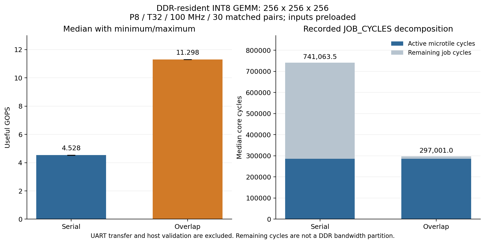

# Nexys GEMM

Signed INT8 matrix multiplication with INT32 results on the Nexys A7-50T.
An output-stationary 8x8 systolic array reuses operands from banked local
memory. Custom RTL handles descriptors, burst DMA, UART commands and counters;
AMD SmartConnect and MIG provide clock/width conversion and DDR2 control.

**The DDR2-backed accelerator works on the FPGA with overlapping load,
compute and store.** The 1 Mbaud P8/T32 image `0x9d4beb4d` passes 30 matched
serial/overlap pairs at 256x256x256: **60 jobs and 3,932,160 output comparisons**,
with complete input, padding and guard-memory checks and zero UART retries.

At 100 MHz, 256x256x256 takes a median **297,001 cycles / 2.97001 ms /
11.298 useful GOPS** in overlap mode. Serial mode on the same image takes
741,063.5 cycles / 4.528 GOPS; the median paired speedup is **2.495x**.
Both measurements include DDR tile loads, result writes and the final write
acknowledgement. Inputs remain in DDR between repetitions; packing,
USB-UART movement and validation are recorded separately.
See the [raw board measurements](results/ddr_overlap/release_1mbaud/board/t32/dense/README.md).



Both modes spend 285,696 cycles in the same array schedules. With overlap,
those schedules occupy 96.2% of the job interval; serial loading and storing
leave substantially more time outside compute.

The controller integrates independent input/result ownership, watchdog and
frozen job counters. Its
[portable integration checkpoint](results/ddr_overlap/timing_predicate/README.md)
passes 154 tests, 1,056 complete jobs and 322,799 output comparisons. Scalar
fault detection reduced the setup shortfall from 2.029 to 0.237 ns. The
[current implementation](results/ddr_overlap/release_1mbaud/t32/README.md)
passes 100 MHz with +0.017/+0.017 ns setup/hold slack, 75 DSPs and 20 RAMB36
equivalents. Its vendor integration passes three framed-UART jobs and all
49 outputs through SmartConnect, MIG and the DDR2 model. The own-checkpoint
review retains clocks, CDC findings, reset exceptions and the worst control path.
The [115200-baud checkpoint](results/ddr_overlap/timing_predicate/final_build/board/README.md)
and earlier [serial DMA comparisons](results/ddr_gemm/read4/board_comparison/README.md)
retain their own source identities and measurement scopes.

## Architecture

```text
Python: pack A / transpose B / upload / START / wait / read C / compare
                              |
                          USB-UART
                              |
                   packet transport + registers
                              |
                     validated job controller
                              |
                       macrotile scheduler
                       /                 \
          banked local tile engine <-> read/write DMA
          A/BT -> P x P array -> C         |
                                          |
                    buffered AXI transactions
                              |
                     64-bit AXI @ 100 MHz
                              |
                  SmartConnect width/clock conversion
                              |
                    128-bit MIG AXI @ 50 MHz
                              |
                       x16 DDR2 @ 200 MHz
```

Descriptors support `1 <= M,N <= 1024`, `1 <= K <= 256`, aligned strides and
disjoint DDR allocations. The host stores B transposed for contiguous
reduction rows. Hardware masks input padding and PE tails, writes only useful
C bytes and reports success after all result writes are acknowledged.
Portable geometry is P=4/8 and T=8/32; the full reduction stays in local banks.

The qualified `ENABLE_OVERLAP=1` hierarchy uses two operand sets and two result
sets with a tagged scheduler and independent load/store DMA. VERSION=0x200
selects serial MODE=0 or overlapping MODE=1 on one image; the default
VERSION=0x100 path remains available. See [architecture](docs/architecture.md)
and [overlap ownership and counters](docs/ddr-overlap.md).

## Evidence

| Check | Completed result |
| --- | --- |
| Arithmetic and array | All 65,536 INT8 pairs; 500 seeded microtiles per array size; three deliberate defects detected |
| Full P8 serial implementation | 100 MHz routed setup/hold +0.203/+0.014 ns; 16,133 LUTs, 19,960 FFs, 72 DSPs, 20 RAMB36 equivalents |
| P8 four-read board | 48 jobs; 49,593 compared outputs; 689,628 checked input/padding/guard bytes; zero UART retries |
| [1 Mbaud P8 dense comparison](results/ddr_overlap/release_1mbaud/board/t32/dense/README.md) | 30 matched pairs at 256x256x256 measure 11.298 GOPS with overlap and 2.495x paired speedup |
| [1 Mbaud P8 maximum-size check](results/ddr_overlap/release_1mbaud/board/t32/maximum/README.md) | Both 1024x1024x256 modes pass; all 2,097,152 outputs independently replayed; one overlap job at 11.509 GOPS |
| [115200-baud P8 board](results/ddr_overlap/timing_predicate/final_build/board/README.md) | Both 48-job modes pass; 30 matched pairs at 64x64x256 measure 8.345 GOPS with overlap and 1.837x paired speedup |
| Matched P4/P8 board scaling | 1.60x dense DDR-job speedup at unchanged source, input bytes and clock |
| [115200-baud P8 maximum-shape check](results/ddr_overlap/timing_predicate/final_build/maximum/README.md) | 1024x1024x256: all 1,048,576 outputs checked; one DDR-resident job at 11.512 useful GOPS |
| [115200-baud P8 repeatability](results/ddr_overlap/timing_predicate/final_build/endurance/README.md) | 368 mixed jobs, 342,286 outputs and both modes over 30.52 continuous minutes; zero mismatches or UART retries |
| Selectable overlap integration | 154-test behavioral AXI RAM checkpoint, including 800 seeded jobs and final-response/fault tests |
| [1 Mbaud P8 implementation](results/ddr_overlap/release_1mbaud/t32/README.md) | Source-matched vendor simulation and production bitstream; routed setup/hold +0.017/+0.017 ns; 75 DSPs, 20 RAMB36 equivalents |
| [Bounded DMA formal checks](results/dma_rows/formal/README.md) | 18 assertions at READ1/4 through 20 timeframes for a fixed descriptor; seven independently decoded reachable witnesses |
| [FIFO and scheduler proofs](results/buffer_formal/README.md) | T8/T32 queue base/induction checks; reduced scheduler MODE0/1 checks through 32 timeframes; 21 queries and 15 decoded witnesses |

Each result belongs to its recorded source and bitstream. The 115200-baud image
passes its maximum-shape and sustained-workload checks. The 1 Mbaud T32 image
passes the dense and maximum-size comparisons above; its remaining shape/repeatability checks
and the controlled T8/T32 benchmark grid remain [release gates](docs/status.md).
Board tests use
cold power-up; warm-reset DDR timing remains open.

The [verification overview](docs/verification.md) maps requirements to tests and their limits.
The [evidence index](docs/README.md) links the compute, memory, transport,
vendor and board records. [Integration history](results/ddr_gemm/README.md)
retains failed routes and the measured improvements. The complete target
contract is in [specification.md](docs/specification.md).

## Use the working board image

With image `0x9d4beb4d` already programmed and its matching local archive
available, close other serial terminals and run:

```sh
python -m host.gemm --port COM11 --manifest build/gemm_release_p8_t32_1mbaud/build.json --mode 1 --m 5 --n 3 --k 9 --repeats 3 --retries 0 --output build/my_gemm_demo
```

The command identifies the image, uploads inputs, runs the FPGA, downloads C
and compares every result and guard byte. It prints PASS with measured cycles
and saves JSON/CSV. Replace COM11 with the board's serial port and choose a
fresh output directory to retain previous results. An already programmed,
ready board can run the Python command directly. With JP1 in JTAG mode,
power-off loses the loaded FPGA image; after a fresh OFF/ON, program the
matching archived image and reload inputs using the [board procedure](docs/ddr-board.md).

The [Python API](docs/host-gemm.md#use-your-own-matrices) accepts your own A
and B matrices and returns C. USB-UART is the loading/control link; on-board
counters measure accelerator execution independently of slow host transfers.

## Build and verify

Public core tests require Linux/WSL, Python 3.12 and Icarus Verilog 12.0.
They run without Vivado or proprietary IP downloads:

```sh
python3 -m venv .venv
.venv/bin/python -m pip install -r requirements-test.txt
make lint test mutation PYTHON=.venv/bin/python
```

Board builds require Vivado 2026.1 with Artix-7 support. A clean clone
regenerates the vendor project and IP:

```sh
python -m pip install -r requirements-host.txt
python scripts/build_ddr_gemm.py --stage sim --overlap --p 8 --t 32 --read-slots 4 --baud 1000000 --build-dir build/gemm_current
python scripts/build_ddr_gemm.py --stage bitstream --overlap --p 8 --t 32 --read-slots 4 --baud 1000000 --build-dir build/gemm_current
```

The bitstream stage requires matching successful vendor simulation and routed
timing/constraint checks. These commands select the development MODE=0/1 path;
use a fresh build directory for changed inputs. Omitting `--overlap` from both
stages builds the original serial hierarchy.
The [board workflow](docs/ddr-board.md) covers inspection, cold power-up,
programming and hardware qualification. [Testing](docs/testing.md) lists
individual suites and reproducible commands.

Generated projects, logs, environments, waveforms and bitstreams stay in
ignored `build/`. Preserve qualified local archives; sources and build scripts
belong in Git. The root `accelerator nexys.xpr` retains the native-DDR baseline;
current AXI/GEMM projects are generated by the scripts.

| Path | Purpose |
| --- | --- |
| `rtl/core/` | Signed PE, array and microtile schedule |
| `rtl/memory/` | Banked buffers, prefetch, AXI bursts and DMA |
| `rtl/control/` | Job/tile ownership, registers, counters and UART transport |
| `platform/nexys_a7/` | Board wrapper, IP configuration and constraints |
| `host/gemm/` | Packing, upload/run/read, validation and measurements |
| `tb/`, `scripts/`, `Makefile` | Verification and build entry points |
| `docs/`, `results/` | Contracts, decisions and source-bound evidence |
