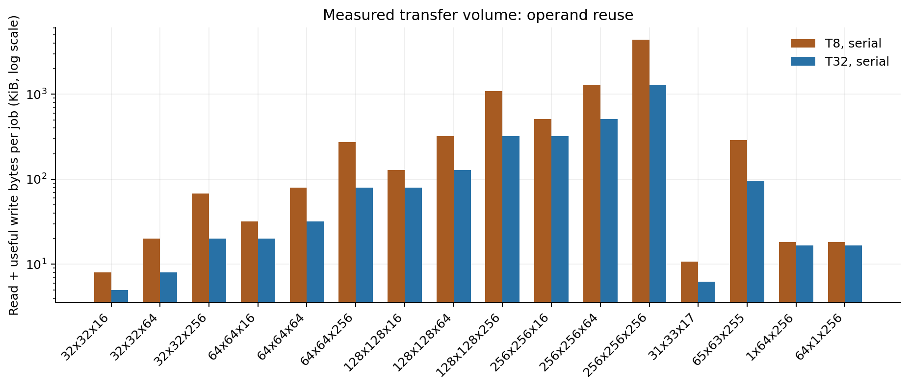

# Selectable DDR load/compute/store overlap

The overlap configuration connects the framed host interface to a validated
job controller, a tagged tile scheduler and independent read/write DMA
contexts. It can load the next macrotile and store an earlier result while
the array computes the current macrotile. The arithmetic and DDR layout remain
signed INT8 inputs, signed INT32 outputs and host-transposed B.
Supported builds use P=4 or 8, T=8 or 32 and KMAX=256.

[`gemm_ddr_core`](../rtl/control/gemm_ddr_core.sv) selects this configuration
with `ENABLE_OVERLAP=1`. It reports development VERSION `0x00000200` and accepts
MODE=0 for serial scheduling or MODE=1 for overlap. The default
`ENABLE_OVERLAP=0` retains the original serial controller, VERSION `0x00000100`
and MODE=0 only. The
[qualified serial image](../results/ddr_gemm/read4/host_geometry/board/README.md)
retains its own evidence. The current [selectable image](../results/ddr_overlap/timing_predicate/final_build/board/README.md)
is independently checked in both modes on the board.
Neither development identity advertises the full v1 release in
[specification.md](specification.md).

## System connections

```text
Python: pack A / transpose B -> upload -> configure -> START -> read C
                               |
                         USB-UART packets
                               |
                   COBS / CRC32 / sequence replay
                               |
                  Command backend <-> Register bank
                         |                 |
                  idle host memory       descriptor
                         |                 v
                         |      gemm_ddr_overlap_job
                         |      validation / status / counters / watchdog
                         |                 |
                         |      gemm_tile_scheduler
                         |      tags / two input owners / two result owners
                         |         |           |             |
                         |       load       compute        store
                         |         |           |             |
                         |    Read DMA --> A/BT banks     Write DMA
                         |         |           |             ^
                         |         |      banked P x P       |
                         |         |      systolic array -> C banks
                         |         |                         |
                         +---------+-------------------------+
                                   |
                          Shared AXI burst engine
                       read channels | write channels
                                   |
                          64-bit AXI at 100 MHz
                                   |
                    SmartConnect width/clock conversion
                                   |
                              MIG -> DDR2
```

[`gemm_tile_dma_duplex`](../rtl/memory/gemm_tile_dma_duplex.sv) gives the loader
and writer separate operation descriptors and completions. The loader uses
the configured one or four in-order read slots; the writer retains one
outstanding burst. Both use the existing
[burst engine](axi-burst.md), including independent AW/W handshakes, response
checks, buffered data and 4 KiB splitting. They share one external AXI master.

Host memory commands own that master only while the job engine is idle.
Ownership cannot switch until both external AXI traffic and buffered local
data/completions are empty. A host memory command during an active job returns
BUSY without modifying memory. Packet validation and exact-request replay
remain the [existing transport contract](ddr-core.md#packet-commands).

## Buffer ownership and scheduling

Each input set contains A and BT for one macrotile's entire K dimension.
Each result set contains one complete C macrotile. There are exactly two of
each set. Input IDs and result IDs belong to separate memories; input set 1
can feed compute into result set 0.

```text
Input:  FREE -> FILLING -> READY -> COMPUTING -> FREE
                  A + BT              |
                                      +-- qualified compute completion

Result: FREE -> COMPUTING -> READY -> WRITING -> FREE
                  reserve                        |
                                                 +-- successful store DONE
                                                     after its final B
```

The scheduler tags macrotiles in row-major order. Loading A and then BT must
both finish successfully before an input becomes READY. Compute selects the
next tag and reserves a whole FREE result set before launching. It keeps the
input and result selected throughout all of that macrotile's microtiles.
The concurrent bank-port rules exclude those active buffers while allowing
DMA to access the other sets; a pending or held C read response keeps its
result set reserved.

The writer retires results in tag order. A result remains WRITING through the
DMA's completion handshake, even if its final AXI B was already accepted.
Two blocked results prevent another compute launch. Loading cannot hold up
the draining of completed results, and DDR backpressure cannot interrupt an
already launched microtile.

```text
Illustrative stage order; columns are intervals, not equal cycle counts.

MODE=0:
interval     0       1       2       3       4       5
load       tile 0                 tile 1
compute            tile 0                 tile 1
store                      tile 0                 tile 1

MODE=1, when buffers and memory permit:
interval     0       1       2       3       4
load       tile 0  tile 1  tile 2  tile 3
compute            tile 0  tile 1  tile 2  tile 3
store                      tile 0  tile 1  tile 2
```

MODE=0 admits a new tile only after the preceding tile retires. MODE=1 allows
admission whenever an input set is FREE. Both retain the same tile order,
tail masks, output bytes and algorithmic transfer volume. MODE=0 in this new
scheduler is a comparison baseline; its control latency need not match the
older serial controller. The detailed internal contract is in
[tile-scheduler.md](tile-scheduler.md).

## Validation and accepted START

The public controller snapshots the full descriptor at the START request
handshake. Validation checks unsigned 32-bit M/N/K before narrowing; M/N must
be 1..1024, K 1..256, MODE 0 or 1 and WATCHDOG_LIMIT at least one. Bases and
strides require 64-byte alignment and enough useful row space.

Conservative allocations include every row's padding:

```text
A  = [A_BASE,  A_BASE  + M*A_STRIDE)
BT = [BT_BASE, BT_BASE + N*BT_STRIDE)
C  = [C_BASE,  C_BASE  + M*C_STRIDE)

All ends <= 128 MiB; the three ranges must be pairwise disjoint.
```

Separate stages use a 34-bit C-stride minimum, 43-bit allocation products
and 44-bit ends. High dimension bits and address overflow cannot disappear
through a narrow multiply or addition. No DMA or compute request is offered
during validation.

For a legal descriptor with readiness maintained, the shell's rising-edge
sequence is:

```text
edge             n       n+1       n+2       n+3       n+4
action        snapshot   basic     sizes     ends      bounds + accept
job epoch        -         -         -         -      starts here
START reply      -         -         -         -      OK becomes visible
```

The n+4 scheduler handshake is the measured acceptance edge. It snapshots
LAST_JOB_ID, clears the previous status/counters and starts work. Holding the
START reply does not pause that accepted job. START acknowledges acceptance,
not completion. A second START while busy returns BUSY; it is never queued.
An invalid descriptor returns BAD_DESC, issues no DMA and preserves the prior
DONE, accepted job ID and frozen counters. Loss of platform readiness during
validation prevents acceptance.

## Public measurements

The register addresses remain those in [ddr-registers.md](ddr-registers.md).
The controller records raw AXI events before local completion propagation.
On success, counters are frozen before DONE is visible.

| Counter | Meaning in VERSION 0x00000200 |
| --- | --- |
| JOB_CYCLES | Timestamp of the final successful result B handshake minus the validated START acceptance timestamp. |
| COMPUTE_CYCLES | Sum of completed macrotiles' active array-schedule cycles; excludes operand prefetch and DMA. |
| READ_BEATS / WRITE_BEATS | Accepted AXI R / W beats belonging to the active job. |
| WRITE_VALID_BYTES | Sum of WSTRB popcounts on accepted W beats. |
| INPUT_WAIT_CYCLES | Cycles when the next ordered compute launch has a free result set but lacks its READY input. MODE=0 also requires the preceding tile to have retired. |
| READ_STALL_CYCLES / WRITE_STALL_CYCLES | RVALID without RREADY / WVALID without WREADY. These are backpressure counts, not total DDR latency. |

INPUT_WAIT_CYCLES excludes time blocked by occupied result sets, active compute
or MODE=0's required store retirement. The older serial version counts its
A/BT loading phases instead; that counter's values are not directly comparable
across the two versions. Completed jobs in either scheduling mode satisfy:

```text
READ_BEATS        = ceil(K/8) * (M*ceil(N/T) + N*ceil(M/T))
WRITE_BEATS       = M*ceil(N/2)
WRITE_VALID_BYTES = 4*M*N
COMPUTE_CYCLES    = ceil(M/P)*ceil(N/P)*(K + 3*P - 1)
Useful GOPS       = 2*M*N*K*CORE_HZ / JOB_CYCLES / 1e9
```

All writes must be acknowledged and local operations drained before public
DONE, so DONE appears after the saved final-B edge. This delay is excluded
from successful JOB_CYCLES. Host packing, upload and readback remain separate
timings.

## Fault capture, watchdog and drain

Memory response (7), protocol (8), watchdog (9) and calibration-loss (10)
errors latch the first fatal code and RESET_REQUIRED. A fault on the same
edge as successful completion takes priority. Fatal state clears DONE,
including a fault after an earlier successful job.

The public fault snapshot uses elapsed cycles to the detection edge. It adds
an accepted unfinished compute operation's pre-edge live compute count to
completed compute counts, once. A compute-counter update on that edge is
excluded; accepted AXI beats, byte strobes and stall/wait conditions on that
edge are included. These public values freeze while internal obligations
continue draining. An idle fault preserves the previous counters and job ID.

```text
accepted memory/core work -> progress -> watchdog observation
                                             |
                                      first-fault register
                                             |
                             scheduler / DMA stop new admission
                                             |
                           retain accepted transfers and owners
                                             |
                 drain core + DMA + local burst state + external AXI
                                             |
                             leave BUSY; RESET_REQUIRED stays set
```

Progress comes from real memory/local handshakes or compute activity.
Software polling and a stalled offer do not reset the watchdog. Its zero
limit is rejected; the captured `limit-1` threshold determines the first
no-progress fault edge. Watchdog feedback is registered because progress
depends on scheduling handshakes; feeding it back combinationally would
create a control loop. Calibration loss is an independent admission-stop
input and also latches the fatal record.

Accepted AXI obligations and held data/completions remain owed after a fault.
No asserted, stalled AXI VALID is withdrawn to abort a job. Buffer ownership
is invalidated only after the accepted operations and both memory boundaries
drain. A hung interface can leave BUSY asserted with ERROR visible. Partially
written C is invalid, and CLEAR_STATUS cannot remove a fatal reset requirement.
Reset must coordinate the core, DMA, conversion and memory platform.

Before calibration has first succeeded, DDR_READY=0 only blocks START. After
it has been observed high, loss is fatal even while idle; calibration returning
does not restore admission. The existing
[cold-start board procedure](ddr-diagnostic.md#reset-qualification-remains-open)
remains the qualified reset procedure.

## Selecting and checking the configuration

The host accepts MODE=1 only after identifying VERSION 0x00000200. The matrix
packing change is explicit:

```python
from host.gemm import pack_inputs, validate

packed = pack_inputs(A, B, mode=1)
device.upload(packed, guards=True)
device.configure(packed.descriptor)
device.start(job_id=1)
counters = device.wait(job_id=1)
C = device.read_output()
validate(C, A, B)
device.check_guards(packed)
```

`device` must already identify the matching image and be ready; the full
connection, validation and guard-check example is in [host-gemm.md](host-gemm.md).
The CLI selects the same descriptor field with `--mode 1`.

The native Python/Vivado build opts in separately from the descriptor mode:

```text
python scripts/build_ddr_gemm.py --overlap --p 8 --t 32 --read-slots 4 --stage sim --build-dir build/gemm_p8_overlap
python scripts/build_ddr_gemm.py --overlap --p 8 --t 32 --read-slots 4 --stage bitstream --build-dir build/gemm_p8_overlap
```

The bitstream stage requires matching successful vendor simulation evidence
and unchanged source/generated-project fingerprints. Build identity records
the feature, geometry and read depth; an older serial manifest cannot identify
the overlap image. Board qualification and controlled MODE=0/1 measurements
must use that new bitstream's own manifest.

Portable checks use the real banks, compute, duplex DMA and burst engine with
behavioral AXI RAM:

```text
make test-ddr-overlap-job PYTHON=.venv/bin/python
make test-ddr-overlap-core PYTHON=.venv/bin/python
```

The [shell suite](../tb/test_ddr_overlap_job.py) checks paired modes with the
same inputs, full output and guard comparisons, public-handshake ownership,
widened invalid descriptors, immutable START replies, independent counter
snapshots, delayed final B, calibration loss, watchdog and fault drain. Its
default seeded exercise is 100 completed small/odd jobs per configuration.
Maximum-size admission checks do not claim a completed maximum-size job.

The [packet suite](../tb/test_ddr_core_overlap.py) checks complete COBS/CRC
commands, both modes, busy exclusions, duplicate START replay and delayed
final B through the integrated core. It runs alongside the existing packet
compatibility cases. [Scheduler tests](../tb/test_tile_scheduler.py) separately
exercise independent buffer IDs and simultaneous load/compute/store.

The [saved overlap record](../results/ddr_overlap/README.md) identifies actual
completed checks and their exact source/build identities. Portable RAM results,
vendor DDR simulation, routed timing and physical measurements are separate
evidence. Full v1 acceptance also requires its remaining coverage, scoped formal
checks and sustained/max-size board tests.

The [first full route](../results/ddr_overlap/initial_timing/README.md) exposed
a fault-code path into thousands of control enables. The current scheduler
exports scalar `detected_fault` separately from `detected_fault_code`; the job
shell uses the scalar for admission, stopping and counter snapshots. Error
normalization and priority remain in the payload path. No clock cycle is added,
and simulation assertions require scalar detection to equal a nonzero selected
fault code. The changed source receives fresh qualification.

The bounded vendor fixture adds a 1x(T+1)x9 MODE=1 job to the scalar and odd
MODE=0 jobs. It crosses two macrotiles, compares every output and checks guards,
traffic and completion through real UART pins, SmartConnect, MIG and the
unchanged DDR2 model. Larger two-dimensional and fault/stall workloads are
covered by the portable suites. Vendor runtime uses an accelerated UART baud;
physical baud and throughput require board measurements.

## Measured overlap on the board at 115200 baud

Build `0x2c680af7` uses P8/T32, four reads outstanding and a 100 MHz core.
After both 48-job qualification plans passed, it ran 30 matched pairs at
M=N=64,K=256. Pair order alternates; both modes receive identical A/BT bytes
and a newly initialized C allocation. Every output and complete allocation
is checked after every job. The [raw record](../results/ddr_overlap/timing_predicate/final_build/board/README.md)
preserves the distribution, byte snapshots, UART trace and exact image identity.

```text
64x64x256, same image and inputs        serial       overlap
Job cycles, median                    46,163.5      25,130
Job cycles, minimum / maximum         46,083/46,320 25,094/25,180
DDR job time, median                  461.635 us    251.300 us
Useful GOPS, median                   4.543         8.345
Active compute cycles                 17,856        17,856
Accepted read / write beats           8,192/2,048   8,192/2,048
Useful result bytes written           16,384        16,384
Input-wait cycles, median             13,781.5      3,431.5
Read / write backpressure cycles      0/260         0/260
```

The median paired cycle ratio is 1.836611; the ratio of cycle medians is
1.836988. The compute schedule and transfer volume are unchanged. Overlap
reduces elapsed time by hiding work between independent stages. A single
32x32 macrotile has no following tile to preload; its measured throughput
stays near 4.5 GOPS in either mode.

The four macrotiles transfer 65,536 input bytes and 16,384 result bytes per
job. At the overlap median, the array is in an active microtile schedule
for 17,856/25,130 = 71.1% of job cycles. Fill/drain cycles inside those
schedules further reduce useful arithmetic utilization to 65.2% of the
12.8-GOPS theoretical peak. These counters identify remaining scheduling
losses; they do not independently measure the DDR bandwidth ceiling.
Zero R-channel backpressure does not mean zero memory-command latency.

A and BT remain in DDR between repetitions. Each FPGA job still includes
DDR-to-bank tile loading, computation, C writes and the final successful B
response. USB-UART upload/download, host polling and validation are separate
times; the 115200-baud host link dominates the wall time of these extensive
readback checks. The workload does not qualify maximum dimensions, endurance,
warm reset or the full benchmark grid.

## Dense board comparison at 1 Mbaud

The separately routed P8/T32 image `0x9d4beb4d` runs the same MODE0/1
architecture at 100 MHz and uses 1 Mbaud for host transport. Its
[dense record](../results/ddr_overlap/release_1mbaud/board/t32/dense/README.md)
checks 30 matched pairs at M=N=K=256, with identical operands and fresh C
sentinels for each sample. All 3,932,160 outputs and complete allocations pass.

```text
256x256x256, same image and inputs     serial        overlap
Job cycles, median                   741,063.5     297,001
DDR-job time, median                 7.410635 ms   2.970010 ms
Useful GOPS, median                  4.527875      11.297751
Active compute cycles                285,696       285,696
Accepted read / write beats          131,072/32,768 in both modes
Useful result bytes written          262,144 in both modes
Input-wait cycles, median            222,368.5     3,471.5
```

There are 64 macrotiles and 1,024 microtile launches. Each active schedule
takes K+3P-1 = 279 cycles, giving 285,696 compute cycles. Overlap raises the
fraction of the job occupied by these schedules from 38.6% to 96.2%, without
changing the arithmetic or transfer volume. The measured median paired
speedup is 2.495140x. Array fill/drain remains inside COMPUTE_CYCLES, so the
useful arithmetic rate is still below the 12.8-GOPS ideal ceiling.

The accepted payload is 1,048,576 input bytes plus 262,144 result bytes per
job. Dividing this by complete-job time describes effective job traffic;
it is not an isolated read/write bandwidth test or a DDR maximum. Read-channel
stall counters measure held R beats, not the delay between AR and the first R.
These distinctions matter when interpreting short-K workloads and tails.

The same image's [maximum-size checks](../results/ddr_overlap/release_1mbaud/board/t32/maximum/README.md)
complete one 1024x1024x256 job per mode. Overlap takes 46.64784 ms / 11.509020
GOPS; all 2,097,152 outputs across both modes are independently recomputed
from the retained DDR input bytes. These are single samples, separate from
the 30-pair dense distribution. Warm reset remains unqualified.

## Shape grid and the remaining bottleneck

The [complete T32 grid](../results/ddr_overlap/release_1mbaud/board/t32/benchmark/README.md)
contains 30 samples per mode for 16 shapes. All 960 jobs compare every output
and complete guarded allocations. The following medians use the same image
and 100 MHz clock; cycle ratios compare the two series medians.

```text
Shape           Serial cycles  Overlap cycles  Cycle ratio  Overlap GOPS
32x32x256       11,569         11,584          0.999x       4.526
64x64x256       46,341         25,209          1.838x       8.319
128x128x256     185,395        79,518          2.331x       10.549
256x256x256     741,063.5      297,001         2.495x       11.298
256x256x16      349,551.5      231,888.5       1.507x       0.904
256x256x64      414,541        234,784         1.766x       3.573
```

A single T32 macrotile has no following tile with which to overlap work.
At K=256, increasing the number of macrotiles from 1 to 64 raises the fraction
of job cycles occupied by active compute schedules from 38.5% to 96.2%.
At 256x256, however, increasing K from 16 to 64 multiplies useful arithmetic
by four while increasing overlap latency by only 1.25%. This shows a large
cost that is independent of the reduction length at short K.

The result path is a likely contributor. Its local-bank adapter delivers one
64-bit C word every four clock edges without stalls. The writer collects a
complete burst before offering it and waits for its B response before
collecting the next burst. A full T32 tile has 512 result beats: about 2,048
collection cycles and 512 W handshakes across the tile's bursts, plus
control/response time. Two result sets permit overlap but do not increase
this writer's service rate. This is an inference from RTL and job counters;
an isolated store-duration measurement is still needed to assign the limit.

The skinny shapes also expose layout costs. Both 1x64x256 and 64x1x256 perform
the same arithmetic, launch eight microtiles and write 256 useful C bytes.
The former writes two 16-beat bursts; the latter writes 64 one-beat bursts
with half the byte strobes enabled. Their overlap median latencies are
50.115 us and 60.290 us. Arithmetic count alone does not predict latency:
row ends, tail strobes and response overhead affect the memory schedule.
These observations do not establish the DDR device's bandwidth ceiling.

## Controlled macrotile comparison

The [completed comparison](../results/ddr_overlap/release_1mbaud/comparison/README.md)
holds P=8, 100 MHz, signed INT8/INT32 arithmetic, four read slots, 1 Mbaud,
core/host sources, mathematical inputs, layouts and C sentinels constant.
Each of 16 shapes has 30 samples in three configurations: T8 serial (A),
T32 serial (B), and T32 overlap (C). B and C share the same bitstream.

```text
256x256x256                         A: T8 serial  B: T32 serial  C: T32 overlap
Job cycles, median                  1,698,969.5   741,063.5      297,001
DDR-job time, median                16.989695 ms  7.410635 ms    2.970010 ms
Useful GOPS, median                 1.974987      4.527875       11.297751
Compute schedule cycles             285,696       285,696        285,696
Accepted R beats                    524,288       131,072        131,072
Accepted W beats                    32,768        32,768         32,768
Useful C bytes                      262,144       262,144        262,144
Input plus useful C bytes           4,456,448     1,310,720      1,310,720
```

Ratios of median cycles give 2.292610x for A/B, 2.495155x for B/C and
5.720417x for A/C. These differ slightly from a median of paired ratios.
Input traffic falls 4x and total accepted payload falls 3.4x. Output traffic
and array schedules stay unchanged.

Increasing T also changes burst and tile-control amortization. With this
guarded layout, C_BASE=131392 is 320 bytes into a 4 KiB page. Independent
address enumeration predicts 8,192 four-beat C bursts for T8, versus 1,984
sixteen-beat and 128 eight-beat bursts for T32: 2,112 bursts total. The extra
eight-beat bursts come from page-boundary splitting. Measured W-stall cycles
fall from 16,384 to 4,224, matching this burst-count ratio. Command counts are
analytical, since job counters record beats rather than every AW/B transaction.
A/B therefore measures the combined effects of larger macrotiles; B/C measures
scheduling on an identical image. Neither ratio is a host-inclusive speedup.

Both routed builds use 16 RAMB36 and eight RAMB18 primitives, or 20 RAMB36
equivalents. Logical operand/result storage grows from 8.5 KiB to 40 KiB,
but the bank widths already determine the smaller build's physical primitives.
T8 is a reuse baseline rather than a proportional physical-memory saving.



The logarithmic axis counts accepted input bytes plus useful C strobes.
It excludes DDR command, refresh and physical burst overhead. Tail latency
and complete distributions are retained alongside the
[third plot](../results/ddr_overlap/release_1mbaud/comparison/collector/tail_latency.png).
