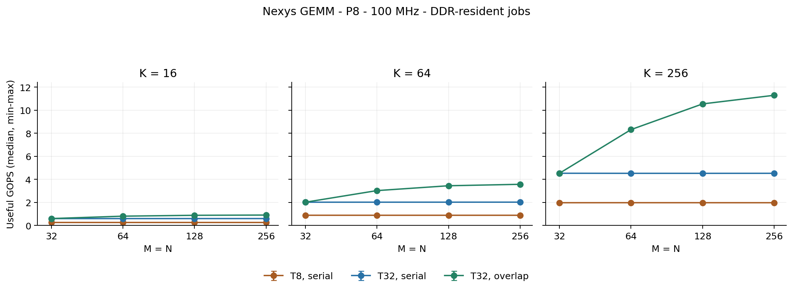

# Measurements

The controlled comparison uses the Nexys A7-50T, P=8, a 100 MHz core,
four outstanding reads and a 1 Mbaud UART. T8 image `0xeed7b111` and T32
image `0x9d4beb4d` share the compute, DMA and host sources. T is the changed
build setting; both images have their own routed timing and board evidence.
T32 serial and overlap use the same bitstream with MODE=0 and MODE=1.

## Dense workload

M=N=K=256, signed INT8 inputs and INT32 outputs. Each series contains 30
completed jobs. Values below come from the retained
[comparison JSON](../results/ddr_overlap/release_1mbaud/comparison/collector/comparison.json)
and [CSV](../results/ddr_overlap/release_1mbaud/comparison/collector/comparison.csv).

| Configuration | Median cycles | Median latency (ms) | Useful GOPS |
| --- | ---: | ---: | ---: |
| T8, serial | 1,698,969.5 | 16.989695 | 1.975 |
| T32, serial | 741,063.5 | 7.410635 | 4.528 |
| T32, overlap | 297,001 | 2.970010 | 11.298 |

The ratio of cycle medians is 2.293x for T8 serial to T32 serial and 2.495x
for T32 serial to overlap: 5.720x overall. The separate same-image
[dense record](../results/ddr_overlap/release_1mbaud/board/t32/dense/README.md)
also reports a median paired MODE0/MODE1 speedup of 2.495x. Paired speedups
and ratios of series medians are different statistics, even when their
rounded values agree.

## Reuse and overlap

For one 32x32 output region with K=256:

| Configuration | Input bytes | Useful C bytes | Total useful transfer bytes |
| --- | ---: | ---: | ---: |
| T8: reload for each 8x8 launch | 65,536 | 4,096 | 69,632 |
| T32: reuse across 16 launches | 16,384 | 4,096 | 20,480 |

Inputs fall 4x; input plus useful output traffic falls 3.4x. These quantities
count accepted AXI input beats and enabled output bytes, not physical DDR
command/bus overhead. Larger tiles also amortize output bursts and scheduler
work, so the speedup is not isolated byte reuse alone.

The dense job launches 1,024 microtiles in all three builds. Their schedules
take 285,696 cycles, including fill and drain. Those cycles occupy 96.2% of
the T32 overlap interval. Useful PE utilization is about 88.3% of the 12.8
GOPS arithmetic ceiling. Schedule occupancy is not the fraction of cycles
performing useful arithmetic in every PE.

```text
useful GOPS = 2*M*N*K*CORE_HZ / JOB_CYCLES / 1e9
useful utilization = M*N*K / (P*P*JOB_CYCLES)
```

JOB_CYCLES starts at validated START acceptance and ends at the final
successful result B handshake. It includes every DDR tile load and result
write. Inputs remain in DDR between repetitions; C sentinels are refreshed
for each job. Packing, upload, host commands/polling, readback and validation
are separately recorded. UART wall time is not an isolated DDR bandwidth test.

## Shapes and plots

The grid covers 16 shapes and 30 jobs per configuration: 480 T8 serial jobs
and 960 T32 serial/overlap jobs. It includes square sizes 32..256 at
K=16/64/256, plus `(31,33,17)`, `(65,63,255)`, `(1,64,256)` and `(64,1,256)`.
Error bars show minimum/maximum around each series median.



- [Throughput PDF](../results/ddr_overlap/release_1mbaud/comparison/collector/useful_gops.pdf)
- [Transfer volume PNG](../results/ddr_overlap/release_1mbaud/comparison/collector/transfer_volume.png) / [PDF](../results/ddr_overlap/release_1mbaud/comparison/collector/transfer_volume.pdf)
- [Tail latency PNG](../results/ddr_overlap/release_1mbaud/comparison/collector/tail_latency.png) / [PDF](../results/ddr_overlap/release_1mbaud/comparison/collector/tail_latency.pdf)

## Evidence and limits

Every board job compares all useful results and guarded A/BT/C allocations.
The grid archives retain counters, input digests, configuration, method and
execution records. They do not retain raw matrices for independent replay
of every live numerical comparison. The separate
[maximum-size record](../results/ddr_overlap/release_1mbaud/board/t32/maximum/README.md)
retains complete memory snapshots and independently replays both jobs at
1024x1024x256; it is one sample per mode, not a latency distribution.

The [30-minute run](../results/ddr_overlap/release_1mbaud/board/t32/endurance/README.md)
is a host-paced repeatability test. It is not continuous peak-rate compute
stress or a lifetime reliability claim. A stopped earlier run and its
read-only recovery remain recorded separately.

All measurements use cold power-up. Warm-reset DDR timing, independently
measured resident-array throughput and isolated DDR read/write/mixed bandwidth
remain [open](status.md). Routed timing and warnings are retained in the
[implementation records](../results/ddr_overlap/release_1mbaud/README.md).
Reproduction commands are in [testing.md](testing.md#physical-tiling-and-overlap-comparison);
original data and standalone validators remain in the
[comparison archive](../results/ddr_overlap/release_1mbaud/comparison/README.md).
